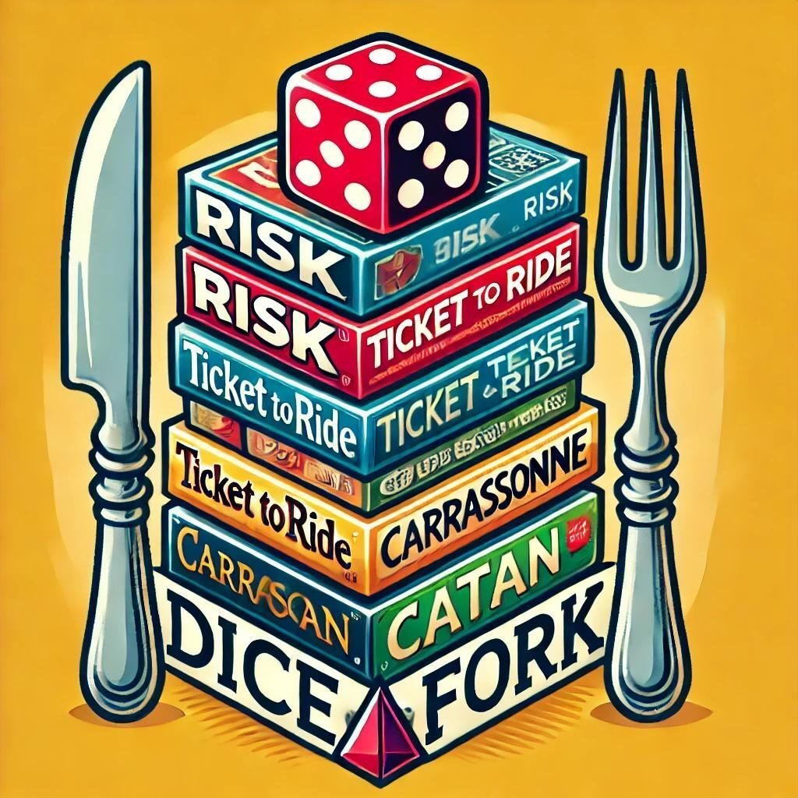

# 🎲 Dice & Fork - Premier Board Game Social Club

A modern, professional website for the Dice & Fork board game social club, built with Next.js 15 and designed to provide an exceptional user experience for board game enthusiasts.



## ✨ Features

### 🏠 **Modern Homepage**

- **Engaging Hero Section** with animated elements and statistics
- **Professional Design** with gradient backgrounds and smooth animations
- **Responsive Layout** that works perfectly on all devices
- **Interactive Elements** with hover effects and micro-interactions

### 🎮 **Game Library**

- **Curated Collection** of 50+ board games
- **Detailed Game Cards** with difficulty indicators, player counts, and descriptions
- **Smart Categorization** by genre, complexity, and player count
- **Professional Game Presentation** with enhanced styling

### 📅 **Event Management**

- **Dynamic Event Cards** with real-time attendance tracking
- **Featured Events** highlighting special tournaments and gatherings
- **Registration System** with Supabase authentication
- **Event Categories** and detailed information display

### 👥 **Member Testimonials**

- **Enhanced Testimonial Cards** with member photos and ratings
- **Social Proof** from real community members
- **Professional Presentation** with verified badges and join dates

### 🎨 **Design System**

- **Custom CSS Variables** for consistent theming
- **Professional Color Palette** with purple, blue, and accent colors
- **Advanced Animations** including floating elements and smooth transitions
- **Glass Morphism Effects** and modern UI patterns
- **Custom Shadows** and gradient implementations

### 📱 **User Experience**

- **Scroll-Aware Navigation** with backdrop blur effects
- **Loading States** and error handling
- **Accessibility Features** with proper ARIA labels and keyboard navigation
- **SEO Optimized** with comprehensive meta tags and Open Graph support

## 🛠️ Technology Stack

### **Frontend**

- **Next.js 15** - React framework with App Router
- **React 19** - Latest React features and improvements
- **TypeScript** - Type-safe development
- **Tailwind CSS 4** - Utility-first styling with custom extensions

### **Styling & Design**

- **Custom CSS Variables** for design system consistency
- **Advanced Animations** with CSS keyframes and Tailwind utilities
- **Responsive Design** with mobile-first approach
- **Modern Typography** using Geist font family

### **Authentication & Backend**

- **Supabase** - Database and authentication
- **API Routes** for server-side functionality
- **Environment Configuration** for security

### **Performance & SEO**

- **Image Optimization** with Next.js Image component
- **Font Optimization** with display swap strategy
- **Meta Tags** for social sharing and SEO
- **Performance Monitoring** ready configuration

## 🚀 Getting Started

### Prerequisites

- Node.js 18+
- npm or yarn
- Supabase account (for authentication features)

### Installation

1. **Clone the repository**

   ```bash
   git clone <repository-url>
   cd diceandfork
   ```

2. **Install dependencies**

   ```bash
   npm install
   ```

3. **Environment Setup**
   Create a `.env.local` file:

   ```env
   NEXT_PUBLIC_SUPABASE_URL=your_supabase_url
   NEXT_PUBLIC_SUPABASE_ANON_KEY=your_supabase_anon_key
   ```

4. **Development Server**

   ```bash
   npm run dev
   ```

5. **Open your browser**
   Navigate to [http://localhost:3000](http://localhost:3000)

### Build for Production

```bash
npm run build
npm start
```

## 📁 Project Structure

```
src/
├── app/                    # Next.js App Router
│   ├── about/             # About page
│   ├── contact/           # Contact page
│   ├── events/            # Events page
│   ├── games/             # Games page
│   ├── join/              # Membership page
│   ├── api/               # API routes
│   ├── globals.css        # Global styles and design system
│   ├── layout.tsx         # Root layout with navigation
│   └── page.tsx           # Homepage
├── components/            # Reusable React components
│   ├── AuthProvider.tsx   # Authentication context
│   ├── EventCard.tsx      # Event display component
│   ├── Footer.tsx         # Site footer
│   ├── GameCard.tsx       # Game display component
│   ├── Navbar.tsx         # Navigation component
│   └── TestimonialCard.tsx # Testimonial component
public/                    # Static assets
├── games/                 # Game images
├── avatars/               # User avatars
├── events/                # Event images
└── logo.jpg              # Club logo
```

## 🎨 Design Features

### **Color Palette**

- **Primary**: Purple gradients (#7c3aed to #5b21b6)
- **Secondary**: Blue tones (#2563eb to #1d4ed8)
- **Accents**: Orange/Pink gradients for CTAs
- **Neutrals**: Carefully balanced grays for text and backgrounds

### **Typography**

- **Headings**: Geist Sans with bold weights (700-900)
- **Body Text**: Geist Sans with optimized line heights
- **Responsive Sizing**: Clamp functions for fluid typography

### **Animations**

- **Entrance Animations**: Fade in up, scale in effects
- **Hover States**: Transform and shadow transitions
- **Floating Elements**: Subtle background animations
- **Loading States**: Shimmer effects and spinners

### **Components**

- **Glass Effects**: Backdrop blur with transparency
- **Gradient Text**: Multi-color text treatments
- **Custom Shadows**: Soft to hard shadow variations
- **Rounded Corners**: Consistent border radius system

## 📱 Responsive Design

### **Breakpoints**

- **Mobile**: 320px - 768px
- **Tablet**: 768px - 1024px
- **Desktop**: 1024px+
- **Large Desktop**: 1440px+

### **Mobile Optimizations**

- Touch-friendly button sizes (44px minimum)
- Simplified navigation with hamburger menu
- Optimized image loading and sizing
- Readable typography at all screen sizes

## ⚡ Performance Features

### **Core Web Vitals Optimized**

- **LCP**: Optimized hero image loading
- **FID**: Minimal JavaScript for interactivity
- **CLS**: Proper image dimensions and loading

### **Loading Optimizations**

- Image optimization with Next.js Image
- Font loading with display: swap
- Component code splitting
- Efficient CSS delivery

## 🔐 Security Features

- Environment variable protection
- Supabase Row Level Security (RLS)
- CSRF protection on forms
- Input validation and sanitization

## 🚀 Deployment

### **Vercel (Recommended)**

1. Connect your GitHub repository to Vercel
2. Add environment variables in Vercel dashboard
3. Deploy automatically on git push

### **Other Platforms**

- **Netlify**: Works with standard build commands
- **AWS Amplify**: Full-stack deployment ready
- **Docker**: Containerization support available

## 🤝 Contributing

1. Fork the repository
2. Create a feature branch (`git checkout -b feature/amazing-feature`)
3. Commit your changes (`git commit -m 'Add amazing feature'`)
4. Push to the branch (`git push origin feature/amazing-feature`)
5. Open a Pull Request

## 📄 License

This project is licensed under the MIT License - see the [LICENSE](LICENSE) file for details.

## 🙏 Acknowledgments

- **Design Inspiration**: Modern SaaS and community websites
- **Icons**: Heroicons and custom SVG illustrations
- **Fonts**: Geist font family by Vercel
- **Framework**: Next.js team for the excellent developer experience

## 📞 Support

For support, email hello@diceandfork.com or join our Discord community.

---

**Made with ❤️ for the board game community**

_Dice & Fork - Where strategy meets community, and every game night becomes an unforgettable adventure._
